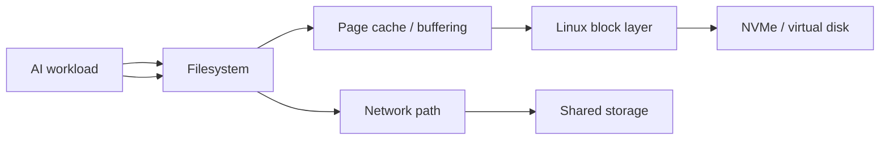

# Checkpoint-Rush

> **The GPUs are expensive, the storage is “fine,” and training still stops every time the cluster checkpoints. Prove where the time is really going.**

## Skills you will build

- Linux storage and filesystem fundamentals
- Throughput, IOPS, latency, queue depth, and access-pattern reasoning
- NVMe/local storage vs shared/network storage concepts
- `fio`, `iostat`, `vmstat`, `lsblk`, and related Linux diagnostics
- Page cache, buffering, and sync behavior concepts
- Sequential vs random I/O and large-file vs small-file behavior
- NFS/shared-storage concepts using a laptop-scale simulation
- AI dataset loading and checkpoint traffic patterns
- Correlating storage pressure with CPU/GPU idle time
- Designing experiments that distinguish storage bottlenecks from compute problems

## General idea

Checkpoint-Rush is the **AI storage-path and bottleneck lab**.

A fictional AI cluster called **Mercury** has a recurring incident: training runs normally until several jobs write checkpoints at roughly the same time. GPU utilization collapses, jobs stall, everyone blames the network, and the storage dashboard says the array is still “up.”

Your job is to recreate the problem at laptop scale and investigate the complete path from application I/O to filesystem, block device, cache, and shared-storage behavior.

The lab asks one deceptively simple question:

> **When the GPU is waiting, what exactly is it waiting for?**

You will use controlled I/O workloads and simulated concurrent jobs to show why “the disk works” is not the same thing as “the storage path can feed an AI workload.”

---

# The incident: The Checkpoint Rush

Mercury runs four long training jobs.

Every thirty minutes, each job saves state.

Individually, each checkpoint completes quickly.

Together:

```text
12:00:00  Job A begins checkpoint
12:00:02  Job B begins checkpoint
12:00:03  Job C begins checkpoint
12:00:05  Job D begins checkpoint
12:00:08  storage latency rises
12:00:11  training throughput falls
12:00:15  GPUs spend more time idle
12:00:40  users report “GPU performance issue”
```

The storage team says nothing failed.

The GPU team says utilization collapsed.

Both statements can be true.

Your job is to connect them.

---

## Investigation campaign

| Run | Incident / experiment | Storage concept | Victory condition |
|---|---|---|---|
| 00 | **Map the Data Path** | filesystem → block device → hardware | explain where a write actually goes |
| 01 | **Know Your Drive** | devices, mounts, filesystems | inventory the real laptop storage path |
| 02 | **Speed Is Not One Number** | throughput vs IOPS vs latency | produce distinct storage baselines |
| 03 | **The Tiny-File Swarm** | metadata/small I/O | explain why many small files behave differently |
| 04 | **The Giant Checkpoint** | sequential large writes | measure sustained checkpoint-style behavior |
| 05 | **The Cache Illusion** | page cache/buffering | distinguish memory-speed results from storage results |
| 06 | **Everybody Writes Now** | concurrency/queueing | reproduce a checkpoint storm |
| 07 | **Across the Network** | NFS/shared storage concepts | compare local and simulated shared paths |
| 08 | **Starve the Accelerator** | pipeline bottlenecks | correlate I/O delay with workload idle time |
| 09 | **Fix It Without Magic** | staggering, caching, local staging | compare mitigation strategies |
| 10 | **The False Suspect** | cross-layer diagnosis | distinguish network/CPU/storage symptoms |
| FINAL | **Rush Hour** | blind bottleneck investigation | find and prove an unknown I/O bottleneck |

---

## The storage path



The diagram is intentionally simplified. As you learn, annotate which layers are involved in each experiment and which metrics can observe them.

---

## The measurement rule

Never describe storage as simply **fast** or **slow**.

Ask:

```text
Fast at what?

Sequential reads?
Sequential writes?
Random reads?
Random writes?
Large blocks?
Tiny blocks?
One process?
Many processes?
Cached data?
Durable writes?
Local device?
Remote filesystem?
```

Checkpoint-Rush is designed to make those distinctions intuitive.

---

## Diagnostic toolkit

Tools can include:

```bash
lsblk
findmnt
df -h
du
iostat
vmstat
pidstat
fio
time
sync
```

Where useful, add network tools from Fabric-Faultline when testing shared storage.

Each tool should answer a question rather than become another command to memorize.

Examples:

```text
lsblk   → What block devices does Linux see?
findmnt → What filesystem/device backs this path?
iostat  → Is the device busy, queued, or showing high latency?
fio     → How does this storage path behave under a controlled access pattern?
vmstat  → Is memory/CPU pressure part of what I am seeing?
```

---

## Rush-hour experiments

### The Synchronized Checkpoint
Launch several processes that write large files at nearly the same time. Compare total completion time with staggered starts.

### The Million-Pebble Problem
Compare a workload that accesses many small files with one that moves equivalent data in larger files.

### The Cache Trap
Run a read repeatedly and investigate why later runs may appear dramatically faster.

### Local Sprint vs Shared Commute
Compare local storage with a laptop-scale NFS/shared-storage setup. Separate storage latency from network latency.

### The Expensive GPU Waiting Room
Run a representative compute workload with an intentionally slow data/checkpoint stage and measure how much wall-clock time is spent waiting on I/O.

The point is not to manufacture impressive benchmark numbers. It is to create visible cause-and-effect.

---

## The checkpoint-storm model

As the project matures, build a simple workload generator that can vary:

```yaml
jobs: 4
checkpoint_size_gb: 4
checkpoint_interval_seconds: 300
start_jitter_seconds: 0
block_size: 1M
sync_behavior: buffered
```

Then change one parameter at a time.

Questions worth testing:

- Does staggering checkpoint start time reduce peak queueing?
- Does local staging help before data is copied to shared storage?
- When does adding concurrency stop improving throughput?
- Which metric gives the earliest sign of saturation?
- Does the “fix” move the bottleneck somewhere else?

---

## Incident report format

```text
Symptom:
Workload pattern:
Expected I/O path:
Measured throughput:
Measured latency:
Concurrency:
Device utilization / queue evidence:
CPU/memory/network observations:
Hypotheses:
Root cause:
Mitigation tested:
Tradeoff introduced:
Production-scale limitation of this experiment:
```

The final line matters. A laptop experiment teaches behavior; it does not automatically predict the exact performance of an enterprise storage array.

---

## Suggested repository structure

```text
Checkpoint-Rush/
├── README.md
├── experiments/
├── fio/
├── workload-generator/
├── shared-storage/
├── measurements/
├── incidents/
├── diagrams/
├── mitigations/
└── evidence/
```

---

## Completion standard

Checkpoint-Rush is complete when you can look at a stalled AI workload and build a test plan that separates:

- compute saturation,
- CPU-side starvation,
- storage throughput limits,
- IOPS/metadata pressure,
- I/O latency,
- cache effects,
- network/shared-storage problems,
- and synchronized workload behavior.

You should be able to explain why buying another GPU may accomplish nothing if the data path cannot keep it busy.

> **The mystery is solved when you can show exactly where the expensive compute started waiting.**
